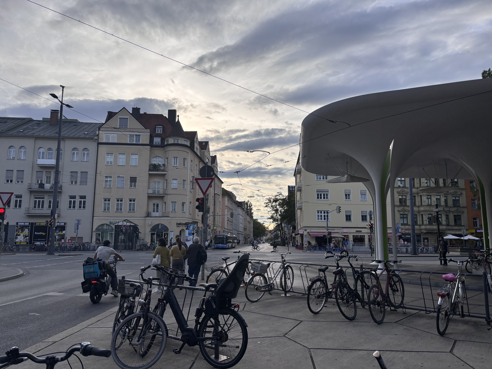

+++
date = '2026-09-17'
draft = false
title = 'From Darkness, Light'
+++

I took this photo on my last day together with Anna-Lena in Munich. It is in many ways extremely ordinary. Pedestrians stroll along the street; a bus drives slowly towards the intersection; bikes are parked haphazardly next to the tram station. It is a spontaneous assembly of everyday lives.

"Are you really photographing this street?" Anna-Lena asks incredulously. "You’re being such a tourist!"

"You don’t understand," I reply. "This sends shivers down my spine."

On the train here, I had learnt about the expulsion of ethnic Germans from Eastern Europe after World War II. Officially so that their presence couldn’t be used as a pretext for annexation, but it became collective retribution for the crimes of the Nazis. Millions were forced to flee, often violently and without notice, just because they were German. Something like half a million people died. It was sobering. I had arrived in Munich burdened, escorted by the ghosts of the past.

But the ordinariness of that scene is what I find extraordinary. I think that if you knew about all the horrors and atrocities here: the concentration camps and gas chambers; the death marches of wretched minorities; the rubbled streets and ruined factories; the one hundred thousand women raped in the fall of Berlin; the millions of homeless expelled German refugees – if you stood on this street in 1945 and were told that within your lifetime, Western and Central Europe would enjoy permanent peace and unprecedented prosperity; that every citizen could travel freely across unguarded borders; that people from every corner of the world call this place their home – you would’ve laughed bitterly at the fantasy. But it’s true. We are living in the incredible proof of a kinder history.

---

A few days later, I am snacking on grapes with Malek and Louis in a park on a tranquil afternoon. Malek studies in Munich on a scholarship from Tunisia. In just a few years, she has built a new life for herself in this country.

"I think if every country in the world was like Germany, the world would be perfect," she muses.

"Wow, that’s strong praise," I say. A few days earlier, I had stepped inside the experimental gas chambers at Dachau; the contrast is sharp in my mind.

But she means it. She tells me about free education at university; government loans for students to study; tap water so clean you can refill your bottle in public bathrooms; a world where everyone has access to opportunity. It is everything that Tunisia deserves to have but doesn’t. Louis jokes that she sounds like she’s interviewing for German citizenship; we laugh amiably.

And perhaps it’s true. In South Korea and Singapore, people called their countries’ development an economic miracle. Germany simultaneously achieved a moral miracle. It is a country that takes in refugees out of moral responsibility; that paid billions in financial reparations to Israel; that reckons honestly with its history. The people living there day to day do not realize the scale of this achievement. It is astonishing. Japanese politicians still struggle to apologize for the crimes of the Empire; Robert Clive’s statue next to the Churchill War Rooms still proudly marks his colonization of India; America has never paid reparations to the descendants of its slaves. Whatever happened before, I think Germans can be proud of how they have written a new chapter of their story.

To me, Germany is also a place of hope. It is hope for a better future. Hope that, no matter how dark the world now may seem, there will be light.

I think the world will get much better still. Maybe within my lifetime too, there will be many more places like Germany.
